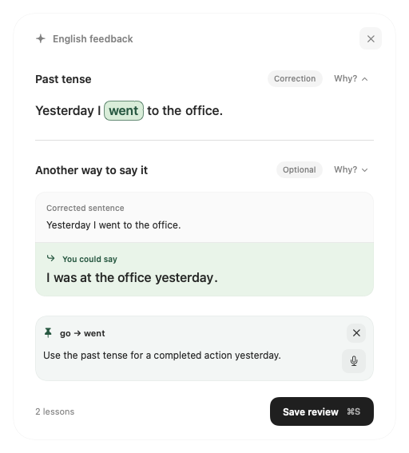
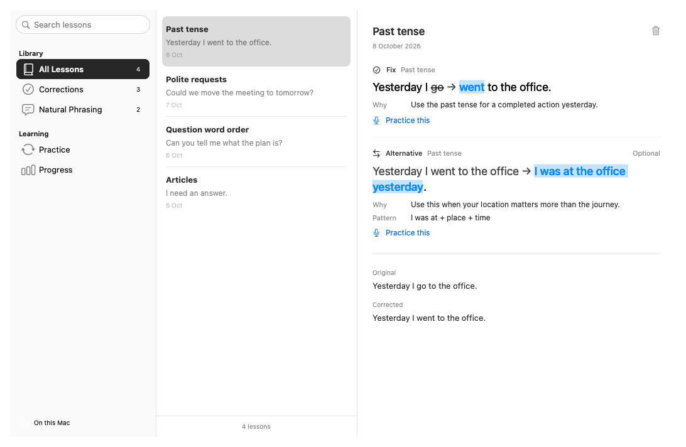

# Voxa

**Dictate on your Mac. Improve your English as you go.**

Voxa turns your voice into text in the app you’re using. Press a shortcut, speak,
and paste your words into messages, emails, notes, and more. Optional English
coaching helps you learn from what you say while you work.

## Speak instead of typing

- **Dictate from any app.** Start from the menu bar or a customizable shortcut.
  Finish or discard a recording from the compact floating bar.
- **Put your words where you need them.** Paste into the active app, copy to the
  clipboard, or copy the result later. Automatic pasting restores your previous
  clipboard when safe.
- **Finish and send.** Use a separate shortcut to paste and press Return in the
  same app—handy for sending a message.
- **Stay in your flow.** One floating panel takes you from the live waveform
  through transcription to English feedback. It appears above the Dock; drag
  the waveform or feedback header to move it. Voxa remembers its position.

The recording bar uses native Liquid Glass on macOS 26 and later, with
translucent material on earlier versions. Audio cues mark recording events.

## Learn from your everyday English

Turn on **English coaching** to get feedback after dictation. Your words are
pasted as dictated; suggestions appear separately for you to review.

- **Understand corrections.** See changes together in their full sentence.
  Click a highlighted correction or **Why?** to open its explanation. Larger
  rewrites show separate original and suggested sentences.
- **Find natural ways to say it.** Explore alternatives and reusable expressions,
  even when your grammar is already correct.
- **Make it stick.** **Save review** keeps every correction and alternative.
  Practise a specific lesson by speaking or typing, then return to the review,
  or revisit saved patterns in a one-minute review.
- **Follow your progress.** Notice recurring patterns and see how your English
  expression develops over time. Level estimates are experimental.

*Voxa’s feedback panel, shown with sample text.*
[See a practice example](assets/screenshots/english-practice.png).

Feedback opens in the same floating panel after your text is delivered. It stays
open until you close it, save it, or start a new recording; clicking elsewhere
leaves it open. **English Learning → Show Latest Feedback** reopens the latest
available review.

Enable it in **Settings → English Learning → Feedback after dictation**.

## Your Mac workspace

- **Searchable Settings.** A native sidebar organizes General, Shortcuts,
  English Learning, and API Key. Search for a page or control, then choose it.
- **A lesson library.** Open **English Learning → Lessons & Progress…** for a
  sidebar, lesson list, and reading pane. Filter by **All Lessons**,
  **Corrections**, or **Natural Phrasing**, and search wording, explanations,
  and patterns. **Practice** and **Progress** have their own sidebar pages.
- **Fits your screen.** Resize the workspace and adjust the lesson-list divider.
  The floating review grows with its contents and scrolls when needed. Views
  follow the system light or dark appearance and accessibility preferences.

*The lesson library, shown with sample lessons.*
[See English Learning settings](assets/screenshots/settings.png).

## Get started

You’ll need **macOS 13 or later**, an **OpenAI API key**, and an internet connection.
OpenAI API usage is billed separately.

Voxa currently installs from source and requires Swift 6.0+ developer tools.
Follow the [installation guide](docs/usage.md#install), then:

1. Open **Settings… → API Key** from the menu bar and save your OpenAI API key.
2. Allow **Microphone**, **Accessibility**, and **Input Monitoring** when prompted.
3. Focus a text field, press **Option + F**, speak, and press it again to paste.

### Default shortcuts

| Action | Shortcut |
| --- | --- |
| Start / Stop dictation | **Option + F** |
| Finish & Send while recording in Autopaste mode | **Option + G** |
| Save every lesson in the visible feedback review and close it | **Command + S** |
| Discard a recording or close feedback without saving lessons | **Esc** |

Change these in **Settings → Shortcuts**: click a key combination, press your
replacement, and release the keys to save it. Save feedback and Cancel / Close
can also be edited in English Learning settings. Feedback displays the configured
shortcuts.

## Your data

Audio is sent to OpenAI for transcription. English coaching is off by default;
when enabled, it also sends your dictated text for feedback, with additional API
usage. Practice sends the selected lesson and your answer for feedback; spoken
answers also use transcription. Nearby-text context is off by default. When
enabled, it sends an excerpt from the active app to help feedback fit your work;
you can exclude apps in Settings.

Your API key is stored in macOS Keychain. Voxa doesn’t save an audio or full-dictation
history to disk; saved lessons, learning progress, and review timing are stored
on your Mac.
[Usage and privacy details](docs/usage.md#audio-and-data).

---

[User guide](docs/usage.md) · [Development](docs/development.md) ·
[Architecture](docs/architecture.md) · [MIT License](LICENSE)

Bundled sounds are [CC0](Sources/Voxa/Resources/Sounds/Zen/LICENSE-AUDIO).
